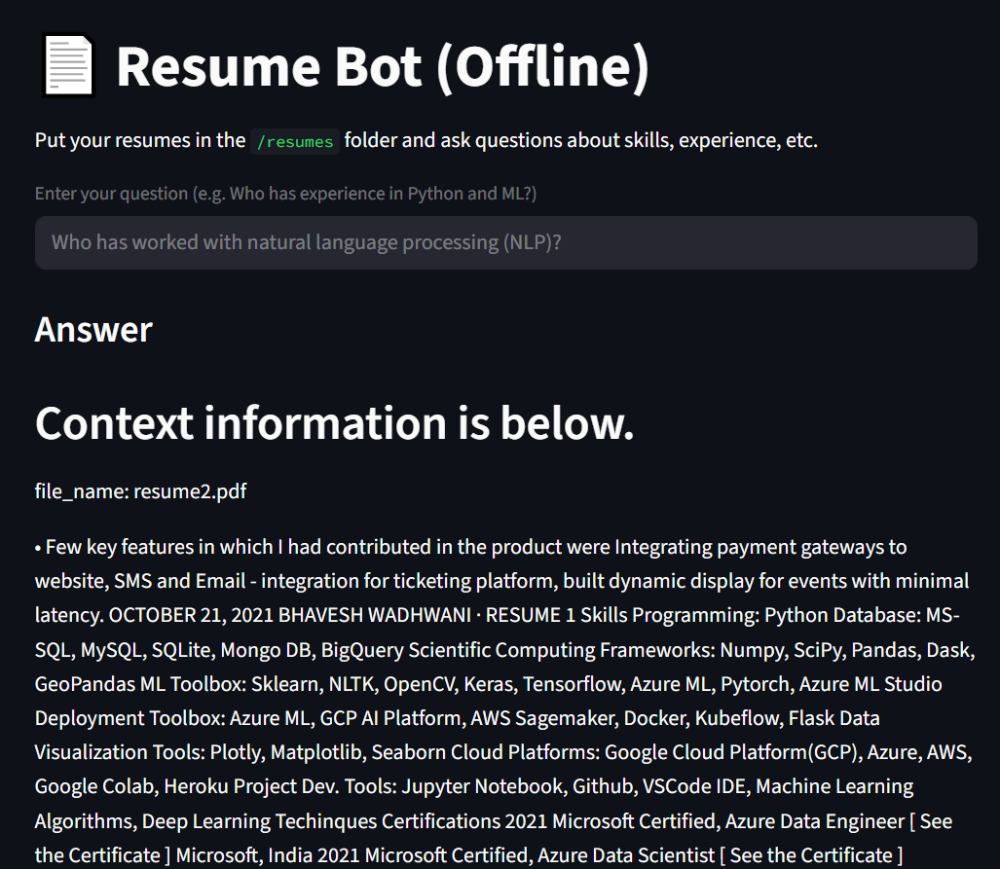
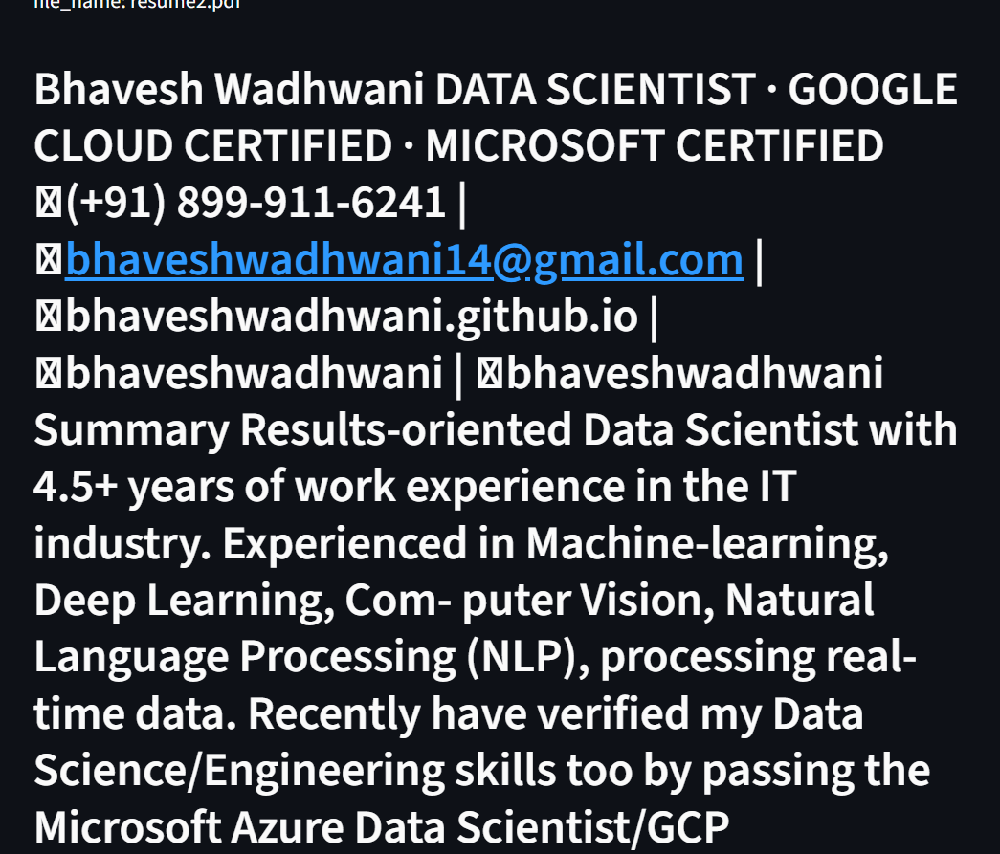

# 🤖 Resume Bot – AI-Powered Resume Search Engine

A Streamlit-based chatbot that allows you to intelligently **search and query resumes** using **LLMs** (like OpenAI GPT) and **LlamaIndex**. Just upload your resumes, and ask questions like:

> 🔍 _"Who has experience in Flutter and cloud computing?"_

---

## 🚀 Features

- ✅ Upload multiple `.pdf` resumes
- ✅ Asks questions in natural language
- ✅ Uses OpenAI (or any LLM) + LlamaIndex for semantic understanding
- ✅ Fast querying using document indexing
- ✅ Clean and intuitive Streamlit UI

---

## 📁 Folder Structure
resume_bot/

├── resumes/
│   ├── resume1.pdf
│   └── resume2.pdf
├── images/
│   ├── screenshot1.png
│   └── screenshot2.png
├── README.md
├── requirements.txt
├── app.py

Screenshots :

